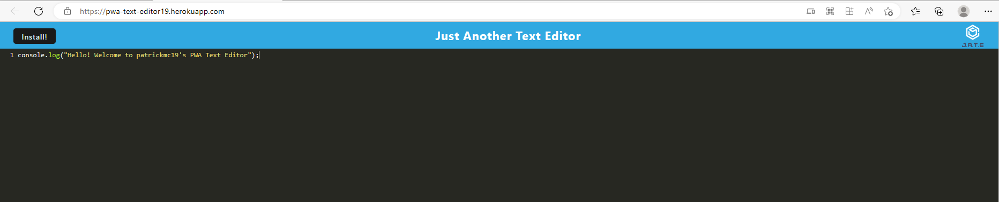

# PWA Text Editor

## Description

This is a simple text editor that can be used as a PWA (Progressive Web App). It is built using webpack, service worker, IndexedDB, concurrently, nodemon, and express. The editor is a single page application that uses a textarea element to allow the user to enter text. The text is saved to a file on the server with IndexDB. The editor is responsive and will work on mobile devices. The editor can be installed as a PWA on mobile devices and desktops. The editor can be used offline as well. The app is deployed through Heroku.

## User Story

```
AS A user
I WANT to be able to enter text into a text editor
SO THAT I can save the text to a file
```

## Acceptance Criteria

```
GIVEN a text editor web application
WHEN I open my application in my editor
THEN I should see a client server folder structure
WHEN I run `npm run start` from the root directory
THEN I find that my application should start up the backend and serve the client
WHEN I run the text editor application from my terminal
THEN I find that my JavaScript files have been bundled using webpack
WHEN I run my webpack plugins
THEN I find that I have a generated HTML file, service worker, and a manifest file
WHEN I use next-gen JavaScript in my application
THEN I find that the text editor still functions in the browser without errors
WHEN I open the text editor
THEN I find that IndexedDB has immediately created a database storage
WHEN I enter content and subsequently click off of the DOM window
THEN I find that the content in the text editor has been saved with IndexedDB
WHEN I reopen the text editor after closing it
THEN I find that the content in the text editor has been retrieved from our IndexedDB
WHEN I click on the Install button
THEN I download my web application as an icon on my desktop
WHEN I load my web application
THEN I should have a registered service worker using workbox
WHEN I register a service worker
THEN I should have my static assets pre cached upon loading along with subsequent pages and static assets
WHEN I deploy to Heroku
THEN I should have proper build scripts for a webpack application
```

## Installation

To install the editor as a PWA, open the editor in a browser and click the install button in the address bar. The editor can also be installed as a PWA by clicking the install button on the editor's home page.

## Usage

To use the editor, open the editor in a browser and enter text in the textarea element. The editor can be used offline once it is installed as a PWA. Local storage allows the text entered to persist upon opening, refreshing, and closing the app.

## Deployed Application

The editor is deployed on Heroku at https://pwa-text-editor19.herokuapp.com/.

## Screenshots



## Questions / Contributing

If you have any questions about this project, please contact the author: https://github.com/patrickmc19
